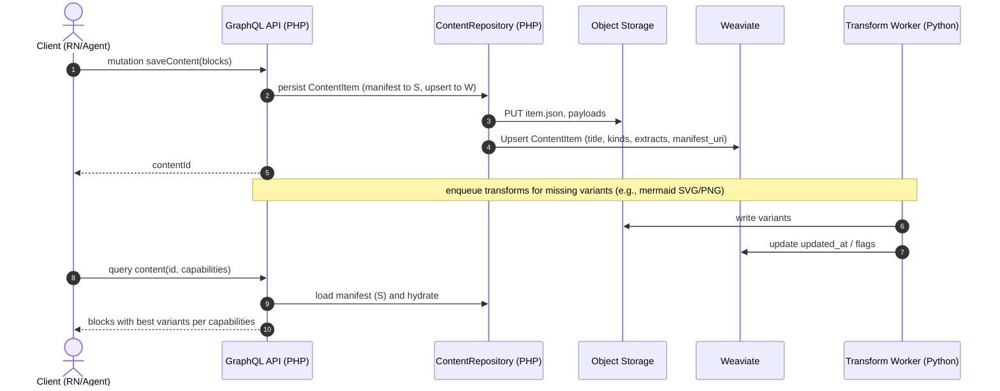

## Portable Content System — Design Document (Draft)

### Overview
- Purpose: Define a cross-language, extensible system to model, transform, and deliver heterogeneous content (markdown, code, images, video, mermaid diagrams, documents, repos, embeds) across React Native, PHP, and Python.
- Core idea: A canonical JSON model (ContentItem → Blocks) plus a Variant mechanism that carries multiple representations (e.g., markdown → HTML, mermaid → SVG/PNG) chosen per client capability.
- Drivers:
  - Some formats render 1:1 (markdown → Markdown renderer), others need domain-specific variants (mermaid → SVG/PNG for mobile).
  - Ensure consistent behavior across languages, safe rendering, and efficient delivery.

### Goals
- Single canonical content model shared across RN (TypeScript), PHP, Python.
- Support multiple representations per block via variants keyed by media type (+ optional parameters).
- Capability-driven selection (best variant per device; fallbacks guaranteed).
- Asynchronous transform pipeline to precompute variants (e.g., thumbnails, SVGs).
- Security-first: sanitization, allowlists, size limits, provenance.
- Strong testing: cross-language validation, golden outputs for transforms.

### Non-Goals (v1)
- WYSIWYG editors or full document editing protocols.
- Arbitrary plugin execution in client contexts.
- Complex per-block permissions (inherit from domain policy).

### Related Documents (spec-local)
- GraphQL SDL Stub: ./graphql/schema.graphql
- JSON Schemas:
  - ./schemas/content-item.schema.json
  - ./schemas/block.schema.json
- Registry reference: ./registry/registry.json and ./registry.md

## High-Level Architecture
- Canonical JSON: ContentItem with ordered Blocks.
- Variants: Each Block keeps a map of media-type → representation metadata (URI or inline payload), optionally annotated with parameters (profile, role, dpi, page, width).
- Content Type Registry: Central registry describing kinds, payload schema, allowed variants, transform rules, sanitizers, fallbacks, cache policy.
- Capability Negotiation: Clients advertise supported media types and hints; server/API selects best variant or triggers generation.
- Transform Pipeline: Python-based workers produce variants (e.g., mermaid → SVG/PNG, PDF → thumbnail) stored in object storage/CDN.
- SDKs: Thin libraries in RN/TS, PHP, Python to validate, select variants, and render/consume safely.

## Canonical Data Model
- ContentItem
  - id, type, metadata (title, createdAt, updatedAt, createdBy), blocks[], optional representations (named views like summary/full).
- Block
  - id, kind (markdown, image, video, mermaid, code, document, repo, embed), payload (canonical), variants (media-type → descriptor), meta (e.g., language, theme).

Example (indicative):
```json
{
  "id": "content_123",
  "type": "note",
  "title": "System Design",
  "blocks": [
    {"id":"b1","kind":"markdown","payload":{"source":"# Title"},
     "variants":{"text/markdown": {"uri": "s3://.../b1.md"},
                  "text/html": {"uri": "https://cdn/.../b1.html"}}},
    {"id":"b2","kind":"mermaid","payload":{"source":"graph TD;A-->B;"},
     "variants":{"image/svg+xml;profile=mermaid": {"uri": "https://cdn/.../b2.svg"},
                  "image/png;profile=mermaid;dpi=192": {"uri":"https://cdn/.../b2@2x.png"}}}
  ]
}
```

## Variants and Media Types
- Keyed by media type with optional parameters to convey semantics (RFC 6906 profiles, roles, quality hints):
  - image/svg+xml;profile=mermaid
  - image/png;profile=mermaid;dpi=192
  - image/png;role=thumbnail;page=1;width=512
  - text/html;profile=markdown
  - text/plain;role=extract
- Variant descriptor fields:
  - uri (or inline value), contentHash, width/height/duration, bytes, generatedBy, toolVersion, createdAt, cachePolicy.

## Content Type Registry
- Central JSON/YAML describing each block kind:
  - id: "markdown" | "code" | "image" | "video" | "mermaid" | "document" | "repo" | "embed"
  - payloadSchema: JSON Schema reference
  - allowedVariants: list of media-type patterns
  - transformerRules: input → outputs (tool, options)
  - sanitization: html/markdown policies, URL allowlists, max sizes
  - fallbackPolicy: e.g., prefer SVG then PNG@2x for iOS/Android
  - cachePolicy: TTL, revalidation triggers (on payload change, toolVersion bump)
- Lives in a shared repo; versioned; consumed by all SDKs.

## Capability Negotiation
- Clients send capabilities (headers or request body) to API:
  - accept: ["image/svg+xml", "image/png", "text/markdown", "text/html"] with q-values or order
  - hints: { width: 1080, density: 3, network: "cellular" }
- Server chooses best available variant or schedules generation; always returns a safe fallback.

## Transform Pipeline (Python-first)
- Architecture: Message queue (e.g., SQS/RabbitMQ) + workers.
- Mermaid → SVG/PNG: run @mermaid-js/mermaid-cli (Node) inside container; SVGO optimize; generate PNG @1x/@2x.
- PDF → thumbnails/extract: poppler-utils/ImageMagick; text via Tika or pdfminer.six.
- Images → responsive sizes: libvips/ImageMagick; or runtime proxy (imgproxy/thumbor).
- Markdown → HTML (optional): unified.js on server or client.
- Provenance stored in variant descriptor (tool, version, options) for reproducibility.

## Storage & Caching
- Object storage (S3/GCS) with CDN. Content-addressed keys (by payload hash + tool/version/options) for idempotency.
- Strong caching headers; immutable variant keys; signed URLs if needed.
- Soft constraints: max payload sizes; strip EXIF for privacy-sensitive images.

## SDKs (React Native, PHP, Python)
- Shared JSON Schemas published with the registry.
- Validation:
  - RN/TS: ajv or typebox; generate types.
  - PHP: opis/json-schema or justinrainbow/json-schema.
  - Python: pydantic or jsonschema.
- Variant selection helpers:
  - preferSvgOrPngForMermaid(capabilities, variants)
  - bestImageVariant(targetWidth, density)
  - bestMarkdownRepresentation(capabilities)
- Rendering:
  - RN: components per kind (Markdown renderer; react-native-svg for SVG; PNG fallback; code syntax highlight via WebView/Prism or lightweight highlighter; document thumbnails with tap-through).
  - PHP: API shaping, selection server-side for web clients.
  - Python: ingestion/transforms; optional server-side rendering for web/exports.

## Supported Block Kinds (v1)
- markdown: payload { source }
  - variants: text/markdown (canonical), text/html (optional), text/plain (extract)
- code: payload { language, source }
  - variants: text/plain (canonical), text/html;profile=highlighted (optional)
- image: payload { uri|storageRef, alt, width, height }
  - variants: image/avif|webp|jpeg at sizes (role=thumb, role=full)
- video: payload { uri, poster?, duration, captions? }
  - variants: video/hls, video/mp4; image/png (poster)
- mermaid: payload { source, theme? }
  - variants: image/svg+xml;profile=mermaid, image/png;profile=mermaid;dpi=96|192
- document: payload { uri, contentType, pages?, bytes? }
  - variants: image/png;role=thumbnail;page=1;width=256|512, text/plain;role=extract
- repo: payload { provider, owner, name, ref?, path? }
  - variants: application/json;role=summary, text/markdown;role=readme, image/png;role=preview
- embed: payload { url, provider?, type? }
  - variants: text/html;role=embed, image/png;role=preview

## API Design (GraphQL for Clients, MCP or GraphQL for Agents)

### GraphQL (Client)
- Schema exposes ContentItem, Block interface with concrete kinds, and Variant.
- Query accepts capabilities and representation hints; server selects best variants and prunes others.

Example types (indicative):

```graphql
scalar JSON
scalar MediaType

interface Block { id: ID!, kind: String!, payload: JSON, variants: [Variant!]! }

type ContentItem { id: ID!, type: String!, title: String, blocks: [Block!]! }

type MarkdownBlock implements Block { id: ID!, kind: String!, payload: JSON, variants: [Variant!]! }

type MermaidBlock implements Block { id: ID!, kind: String!, payload: JSON, variants: [Variant!]! }

type Variant { mediaType: MediaType!, uri: String, width: Int, height: Int, bytes: Int }

input CapabilitiesInput { accept: [MediaType!]!, width: Int, density: Int, network: String }

type Query { content(id: ID!, capabilities: CapabilitiesInput, representation: String): ContentItem }
```

Example query:

```graphql
query GetContent($id: ID!, $caps: CapabilitiesInput) {
  content(id: $id, capabilities: $caps, representation: "summary") {
    id
    title
    blocks {
      id
      kind
      ... on MermaidBlock { variants { mediaType uri width height } }
      ... on MarkdownBlock { variants { mediaType uri } }
    }
  }
}
```

## Persistence (Weaviate + Object Storage)
- Single Weaviate class: ContentItem (one per content aggregate). Store pointers to canonical manifests and extracts; keep heavy assets in object storage.
- Indicative properties:
  - id (UUID), workspace_id (text UUID), owner_type (text), owner_id (text UUID), type (text), title (text), summary (text)
  - kinds (text[]), manifest_uri (text), summary_extract (text), block_extracts (text[])
- Summarization:
  - Maintain a human-authored or AI-generated ContentItem.summary (short text) to help AI/clients quickly understand the item (especially for links/documents).
  - Optionally also compute summary_extract (compact algorithmic extract) for indexing, distinct from the editorial summary.

  - created_at (date), updated_at (date), flags (text[])
- Object Storage layout (content-addressed):
  - /content/{content_id}/item.json (canonical JSON)
  - /content/{content_id}/blocks/{block_id}/payload.*
  - /content/{content_id}/blocks/{block_id}/variants/{encoded-media-type}/...
- Indexing/Vectorization: vectorize title + summary_extract + block_extracts; filter by workspace_id/owner fields.
- Optional future: add ContentBlock class for block-level search when needed.

## PHP Interfaces & Hydration (Sketch)
- Block interface and concrete classes per kind; ContentItem aggregate; hydrator and repository.

```php
interface BlockInterface { public function kind(): string; }
abstract class AbstractBlock implements BlockInterface { /* common fields: id, payload, variants */ }
final class MarkdownBlock extends AbstractBlock { /* payload: source; variants map */ }
final class MermaidBlock extends AbstractBlock { /* payload: source, theme? */ }

final class ContentItem {
  public function __construct(
    public string $id,
    public string $workspaceId,
    public ?string $title,
    /** @var BlockInterface[] */ public array $blocks = [],
  ) {}
}

final class VariantDescriptor {
  public function __construct(
    public string $mediaType,
    public ?string $uri = null,
    public ?int $width = null,
    public ?int $height = null,
    public ?int $bytes = null,
    public ?string $contentHash = null,
    public ?string $generatedBy = null,
    public ?string $toolVersion = null,
  ) {}
}

interface ContentRepository {
  public function save(ContentItem $item): void; // upsert Weaviate + upload manifests
  public function getById(string $id): ContentItem; // load manifest + hydrate
}

final class ContentHydrator {
  public function __construct(private BlockHydratorRegistry $registry) {}
  public function hydrateFromJson(array $manifest): ContentItem { /* ... */ }
}

final class BlockHydratorRegistry {
  /** @var array<string, callable(array): BlockInterface> */ private array $map = [];
  public function register(string $kind, callable $factory): void { $this->map[$kind] = $factory; }
  public function make(string $kind, array $data): BlockInterface { return ($this->map[$kind])($data); }
}

final class VariantSelector {
  /** @param VariantDescriptor[] $variants */
  public function best(array $variants, array $capabilities): ?VariantDescriptor { /* media-type matching with params */ }
}
```

## Weaviate Provisioner (Draft)
- Ensure ContentItem class exists with proper properties and vectorization.
- Centralize in the Weaviate schema provisioner list.

```php
final class WeaviateContentProvisioner {
  public function __construct(private WeaviateClient $client) {}
  public function ensure(): void {
    $class = [
      'class' => 'ContentItem',
      'description' => 'Content aggregates with block variants and extracts',
      'vectorizer' => 'text2vec-openai', // or configured default
      'properties' => [
        ['name' => 'workspace_id', 'dataType' => ['text']],
        ['name' => 'owner_type', 'dataType' => ['text']],
        ['name' => 'owner_id', 'dataType' => ['text']],
        ['name' => 'type', 'dataType' => ['text']],
        ['name' => 'title', 'dataType' => ['text']],
        ['name' => 'summary', 'dataType' => ['text']],
        ['name' => 'kinds', 'dataType' => ['text[]']],
        ['name' => 'manifest_uri', 'dataType' => ['text']],
        ['name' => 'summary_extract', 'dataType' => ['text']],
        ['name' => 'block_extracts', 'dataType' => ['text[]']],
        ['name' => 'flags', 'dataType' => ['text[]']],
        ['name' => 'created_at', 'dataType' => ['date']],
        ['name' => 'updated_at', 'dataType' => ['date']],
      ],
    ];
    // Pseudocode: check if class exists; if not, create.
    // $this->client->schema()->ensureClass($class);
  }
}
```

## Mermaid Workflows

Sequence: ingest → transform → serve



### MCP (Agents)
- Tools mirror GraphQL capabilities:
  - get_content(id, capabilities, representation?)
  - refresh_variants(id, kinds?)
- Agents default to text/plain;role=extract for reasoning; can request visual variants as needed.

## Security & Safety
- Sanitize HTML/markdown (CSP, no inline scripts); mermaid with securityLevel=strict; disallow includes.
- URL allowlists for embeds/documents; verify content types.
- Size limits per kind; reject or downscale.
- Redact EXIF; enforce MIME sniffs on uploads.

## Testing Strategy
- Contract tests: JSON fixtures per kind; validate across TS/PHP/Python.
- Golden tests: transforms (mermaid→SVG/PNG, pdf→thumb) with hash/tolerance checks.
- Client snapshot tests: RN components rendering representative blocks.
- Property tests: variant selection vs randomized capabilities.
- Integration: ingest → transform → API selection → client render.

## Observability
- Emit events: content.created, content.updated, variant.generated, variant.error.
- Metrics: queue latency, transform durations, cache hit rates, variant size distributions.
- Tracing across ingest → transform → serve.

## Prior Art & Inspirations
- Block-based models (Notion), Portable Text (Sanity), oEmbed (normalized embeds), ActivityStreams (typed objects), IIIF Image API, Pandoc AST, unified.js (remark/rehype), Jupyter nbformat.

## Risks & Mitigations
- SVG rendering inconsistencies on mobile → provide PNG fallbacks; test devices; react-native-svg.
- Transform brittleness (tool changes) → pin versions; provenance; golden tests.
- Payload bloat → capability-based pruning; pagination; lazy asset fetch.
- Security of embeds → strict allowlists; sandboxed iframes for web; never eval in RN.

## Rollout Plan
1) Define JSON Schemas and Type Registry; publish as versioned package.
2) Implement Python transform worker for mermaid, images, PDFs; wire to storage/CDN.
3) Add API selection logic (capabilities → best variants) and endpoints.
4) Build RN components per kind with variant selection helpers; implement fallbacks.
5) Add security policies and cross-language validations; set up tests and CI.
6) Expand kinds (repo, embed) and advanced transforms.

## Open Questions
- Node-based transforms inside Python pipeline acceptable (container boundary)?
- Object storage/CDN choices and signing strategy?
- Office docs support scope (LibreOffice vs external service)?
- How aggressively to precompute vs on-demand generate variants?

## Appendix: Media Type Parameter Examples
- image/svg+xml;profile=mermaid
- image/png;profile=mermaid;dpi=192
- image/png;role=thumbnail;page=1;width=512
- text/html;profile=markdown
- text/plain;role=extract

