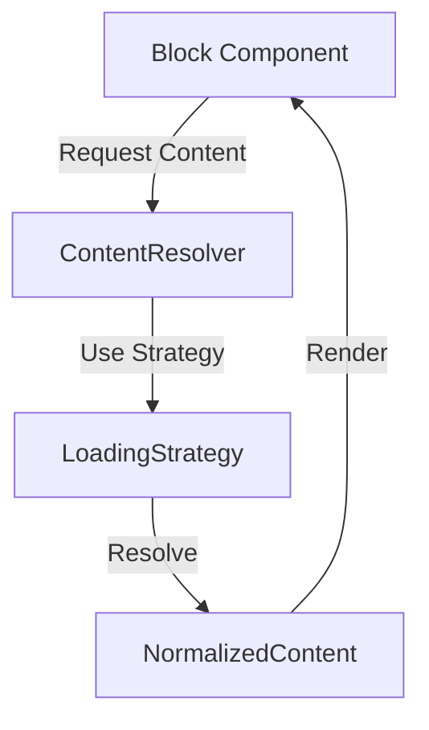

# Content Resolution Architecture

## Overview

This implementation provides a flexible system for handling portable content blocks with different loading strategies. The architecture is designed to support both immediate and lazy loading patterns while maintaining a clean separation of concerns.

## Key Components

### ContentResolver

The ContentResolver acts as the central coordinator for content loading and normalization. It uses the Strategy pattern to support different loading behaviors:

```typescript
ContentResolver
  └─ LoadingStrategy (interface)
      ├─ EagerLoadingStrategy
      └─ LazyLoadingStrategy (future)
```

**Why Strategy Pattern?**
- Encapsulates different loading behaviors
- Allows runtime switching of loading strategies
- Facilitates testing with mock strategies
- Provides clear extension points for future loading patterns

### Content Flow



### Loading Strategies

1. **EagerLoadingStrategy**
   - Immediately loads content
   - Handles both inline and external content
   - Provides synchronous-like interface

2. **LazyLoadingStrategy** (Future)
   - Returns placeholder/handle immediately
   - Loads content on demand
   - Supports cancellation
   - Manages loading states

## Implementation Details

### Core Interfaces

The system is built around several key interfaces:

1. `BlockContent` - Raw content structure from API
2. `NormalizedContent` - Processed content ready for rendering
3. `LoadingStrategy` - Content resolution behavior
4. `LazyContentHandle` - Future-loading control interface

### Error Handling

- Centralized error capture in ContentResolver
- Strategy-specific error states
- Component-level error boundaries

### Future Considerations

1. **Caching Layer**
   - Strategy-aware caching
   - Cache invalidation policies
   - Memory management

2. **Priority Loading**
   - Content importance levels
   - Loading queue management
   - Resource allocation

3. **Network Awareness**
   - Connection-state detection
   - Adaptive loading patterns
   - Offline capabilities

## Usage Guidelines

1. Components should use ContentResolver rather than direct content access
2. Error handling should be implemented at both resolver and component levels
3. Loading strategies should be configured at app initialization
4. Custom strategies should implement the LoadingStrategy interface

## Testing Strategy

1. Mock strategies for unit testing
2. Integration tests for strategy switching
3. Network simulation for external content
4. Error state verification